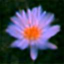
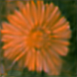
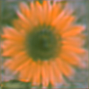
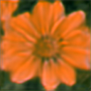

<div align="center">

# Flower VAE

**A from-scratch PyTorch Variational Autoencoder that reconstructs and generates 128×128 flower images from a 256-dimensional latent space.**

<p>
  
  
  
  
  
</p>

<sub><i>Selected reconstructions from the trained VAE.</i></sub>

<p>
  
  
  
  
</p>

</div>

---

## At a glance

| | |
|---|---|
| **Task** | Image reconstruction & generation |
| **Domain** | Oxford 102 Flower Dataset (8,189 images) |
| **Model** | Convolutional β-VAE with VGG perceptual loss |
| **Resolution** | 128 × 128 RGB |
| **Latent space** | 256-dimensional Gaussian |
| **Trainable params** | ~6.3 M (encoder + decoder) |
| **Training time** | ~3 h on Apple M4 Max (256 epochs) |

---

## Table of contents

1. [Why a VAE?](#why-a-vae)
2. [The training objective](#the-training-objective)
3. [Architecture](#architecture)
4. [Hyperparameters](#hyperparameters)
5. [Project structure](#project-structure)
6. [Quickstart](#quickstart)
7. [Pretrained weights](#pretrained-weights)
8. [Dataset](#dataset)
9. [Training setup](#training-setup)
10. [References](#references)

---

## Why a VAE?

A vanilla autoencoder learns to compress an image into a code and reconstruct it — but **nothing constrains where those codes land**. Sample a random point in latent space and decode it: noise. The autoencoder has no incentive to keep its codes near each other, near zero, or even on a contiguous manifold.

A **Variational Autoencoder** fixes this by treating the encoder as a *probabilistic* mapping. Each image yields a Gaussian `N(μ, σ²)`, and a KL term pulls every per-image posterior toward the prior `N(0, I)`. Two consequences fall out:

> **Continuity.** Nearby points decode to perceptually similar images.
> **Generativity.** Pure samples from `N(0, I)` land on the data manifold — so you can synthesize new flowers without an input image.

Sampling `z ~ N(μ, σ²)` is non-differentiable, which would break backprop through the encoder. The **reparameterization trick** moves the randomness outside the computation graph:

```
z = μ + σ · ε,    ε ~ N(0, I)
```

Now `z` is a deterministic function of `(μ, σ)` and a fixed noise sample, so gradients flow cleanly back through `μ` and `σ` while the stochasticity rides along on `ε`.

---

## The training objective

Three losses, each doing a job the other two cannot:

```
L  =      MSE(x̂, x)                       ← reconstruction (pixel fidelity)
   +  β · KL( N(μ, σ²) ‖ N(0, I) )        ← latent regularization
   +  λ · ‖ φ(x̂) − φ(x) ‖²                ← perceptual loss (VGG16, relu4_3)
```

| Term | Role | Why it's needed |
|---|---|---|
| **Reconstruction MSE** | Anchors the decoder to the actual pixels of the input. | Without it, the model can satisfy the KL term trivially by ignoring `x` entirely. |
| **KL divergence** | Pulls every posterior toward `N(0, I)`. | Without it, the encoder collapses into a deterministic point map and the latent space becomes unsamplable. |
| **VGG perceptual loss** | Matches deep VGG16 features of `x̂` and `x`. | Pixel-MSE rewards hedging — averaging over plausible reconstructions yields blur. Feature-matching forces the decoder to commit to specific edges, petal patterns, and color transitions. |

> **Why VGG `relu4_3` specifically?** Earlier layers (`relu1_*`, `relu2_*`) are too close to raw pixels — they punish low-level noise but miss texture. Later layers (`relu5_*`) are too semantic — they happily accept blurry "flower-shaped blobs". `relu4_3` sits in the sweet spot where features encode local texture and shape but not yet object identity, which is exactly the level at which a reconstruction looks crisp to a human eye.

---

## Architecture

### Encoder · `(3, 128, 128) → μ, log σ² ∈ ℝ²⁵⁶`

```
img (3, 128, 128)
  ↓ DoubleDownConv ×4    →  (256, 8, 8)
  ↓ refine (Conv → GN → GELU → Conv)
  ↓ ┌─ hid_2_mean    : Conv → AdaptiveAvgPool(4,4) → MLP → μ
    └─ hid_2_logvar  : Conv → AdaptiveAvgPool(4,4) → MLP → log σ²
```

Each `DoubleDownConv` = `Conv → GN → GELU → Conv → GN → GELU → MaxPool(2)`.

### Decoder · `z ∈ ℝ²⁵⁶ → (3, 128, 128)`

```
z (256)
  ↓ Linear → Unflatten(128, 8, 8) → Conv → GN → GELU
  ↓ DoubleUpConv ×4      →  (3, 128, 128)
  ↓ refine RGB
```

Each `DoubleUpConv` = `Conv → GN → GELU → Conv → GN → GELU → Upsample(bilinear, ×2)`.

### Why these design choices?

| Choice | Why |
|---|---|
| **GroupNorm** instead of BatchNorm | BatchNorm couples samples within a batch and behaves differently in `train` vs `eval`. For a VAE, where per-image posteriors carry the model's signal, that coupling poisons the latent. GroupNorm is batch-independent and behaves identically at train and inference. |
| **GELU** instead of ReLU | Smooth gradients at zero help the VGG perceptual gradient flow back through deep stacks; ReLU's hard cutoff causes more dead units in the decoder. |
| **Bilinear upsample + Conv** instead of `ConvTranspose2d` | `ConvTranspose2d` produces checkerboard artifacts when stride and kernel don't divide evenly (Odena et al., 2016). Bilinear upsampling has no such pathology, and a following conv recovers the expressive capacity. |
| **Two independent heads** for μ and log σ² | Decouples *where the code is* from *how confident the encoder is*. A shared trunk would force them to share representations even when their gradients pull in different directions. |
| **Predict log σ²**, not σ | Keeps σ strictly positive without a clamp, and turns the multiplicative `1/σ²` in the KL term into a stable subtraction. |
| **AdaptiveAvgPool(4,4)** before the MLP heads | Spatial pooling discards the last bit of grid structure before the latent — without it the linear layer would have to learn translation-invariance from scratch. |
| **Latent dim = 256** | Large enough to encode petal layout, color gradients, and species variation; small enough that the KL term remains a meaningful regularizer. Smaller (e.g. 64) caused noticeable mode-averaging; larger (e.g. 1024) inflated KL without sharper reconstructions. |
| **Dropout 0.3 on the latent heads only** | Acts as additional regularization on the bottleneck, where overfitting is most damaging. The convolutional stacks see enough natural augmentation through GroupNorm + image augments to not need it. |

---

## Hyperparameters

All configurable in [`code/config.py`](code/config.py).

<table>
<tr><th align="left">Training</th><th></th><th align="left">Model</th><th></th></tr>
<tr><td>Batch size</td><td><code>64</code></td><td>Latent dim <code>z</code></td><td><code>256</code></td></tr>
<tr><td>Epochs</td><td><code>256</code></td><td>Encoder/Decoder stages</td><td><code>4</code></td></tr>
<tr><td>Learning rate</td><td><code>5e-5</code></td><td>Channels</td><td><code>3 → 32 → 64 → 128 → 256</code></td></tr>
<tr><td>Optimizer</td><td><code>AdamW</code></td><td>GroupNorm groups</td><td><code>8</code></td></tr>
<tr><td>KL β</td><td><code>1.0</code></td><td>Dropout (latent heads)</td><td><code>0.3</code></td></tr>
<tr><td>VGG weight</td><td><code>10000</code></td><td>VGG cutoff</td><td>layers 0–22 (relu4_3)</td></tr>
<tr><td>Image size</td><td>128 × 128</td><td></td><td></td></tr>
</table>

> **Why `VGG_LOSS_WEIGHT = 10000`?** Feature-MSE at relu4_3 sits around 10⁻¹–10⁻², while pixel-MSE on 128×128 RGB sits in the thousands. Without rescaling, the gradient is dominated by pixel-MSE and the perceptual term becomes decorative. After rescaling, all three losses sit in the same order of magnitude and each contributes meaningfully to updates.

> **Why `KL_BETA = 1.0`?** Setting β > 1 (β-VAE) trades reconstruction sharpness for disentanglement — useful when you care about interpretable latent axes, harmful when you just want clean samples. β < 1 risks KL collapse. β = 1 recovers the standard ELBO and matched what the perceptual term was already pushing for.

> **Why `lr = 5e-5` with no scheduler?** The VGG-weighted objective has a well-behaved loss surface, and the perceptual loss continues to drop steadily over the full 256 epochs. A warm restart or cosine schedule would interrupt that descent for no measurable gain. A constant low LR over 256 epochs reaches a sharp reconstruction without oscillation.

```python
rec_loss = F.mse_loss(y_preds, y, reduction='sum') / batch_size
kl_loss  = beta * (-0.5 * torch.sum(1 + logvar - mean**2 - logvar.exp())) / batch_size
p_loss   = vgg_weight * F.mse_loss(vgg(y_preds), vgg(y))
```

---

## Project structure

```
.
├── code/
│   ├── model.py        # Encoder, Decoder, VAE with reparameterization
│   ├── train.py        # Training loop, VGG perceptual loss, checkpointing
│   ├── config.py       # All hyperparameters and paths
│   └── vis_outs.py     # Load checkpoint, reconstruct and display samples
├── docs/TRAINING.md    # Detailed training and resuming notes
├── samples/            # Example reconstructions
├── checkpoints/        # Model weights — not tracked
├── data/               # Oxford 102 Flower images — not tracked
├── requirements.txt
└── README.md
```

---

## Quickstart

```bash
git clone https://github.com/franciszekparma/flovae.git
cd flovae
pip install -r requirements.txt
```

**Dependencies:** `torch`, `torchvision`, `numpy`, `matplotlib`, `Pillow`, `tqdm`

### 1 · Prepare data

Download the [Oxford 102 Flower](https://www.robots.ox.ac.uk/~vgg/data/flowers/102/) images and drop every `.jpg` directly under `data/`.

### 2 · Train

```bash
python code/train.py
```

A checkpoint lands in `checkpoints/vae_epoch_{N}.pth` after every epoch. `checkpoints/best_model.pth` is overwritten whenever total loss improves.

To **resume**, set in `code/config.py`:

```python
LOAD_WEIGHTS = True
RESUME_EPOCH = 128
```

### 3 · Generate / reconstruct

```bash
python code/vis_outs.py
```

Loads `checkpoints/vae_epoch_{DISP_EPOCH}.pth`, encodes a random sample, draws `z` via reparameterization, decodes, denormalizes, and shows each reconstruction.

> All commands run from the repo root.

---

## Pretrained weights

You don't need to train from scratch — epoch-256 weights are available:

> **Google Drive:** https://drive.google.com/file/d/1d1xBw9PyHieS6IWYMfGlUz4XLphP0Qau/view?usp=sharing

Drop the file in `checkpoints/` as `vae_epoch_256.pth`, set `DISP_EPOCH = 256` in `code/config.py`, and run `python code/vis_outs.py`.

---

## Dataset

**Oxford 102 Category Flower Dataset** (Nilsback & Zisserman, 2008) — 8,189 images across 102 categories.

| Step | Setting | Why |
|---|---|---|
| Resize | 140 × 140 | Larger than the final crop, so the random/center crop has room to discard borders without losing the subject. |
| Crop | center → 128 × 128 | Fixed crop keeps the flower centered; deterministic at eval, identical at train (the augmentation comes from the *next* steps). |
| Normalize | ImageNet mean/std | VGG16 was trained on ImageNet-normalized inputs. Feeding it `[0, 1]` tensors silently shifts the perceptual loss to a regime VGG was never optimized in, and the gradients become much less informative. |
| Augment | HFlip · saturation × 1.3 · `ColorJitter(0.15, 0.1, 0.1, 0.05)` | Deliberately gentle. Heavier augmentation pushes the encoder to spend latent capacity on nuisance variation rather than flower identity. |

---

## Training setup

Trained on a **MacBook Pro (M4 Max)** using PyTorch's MPS backend. The model auto-selects `cuda` if available and falls back to `mps` otherwise — see `DEVICE` in `code/config.py`.

For a full breakdown of how each loss term behaves over training, how to spot posterior collapse, and how to resume cleanly, see [`docs/TRAINING.md`](docs/TRAINING.md).

---

## References

- Kingma & Welling (2013). [Auto-Encoding Variational Bayes](https://arxiv.org/abs/1312.6114).
- Simonyan & Zisserman (2014). [Very Deep Convolutional Networks for Large-Scale Image Recognition](https://arxiv.org/abs/1409.1556).
- Nilsback & Zisserman (2008). [Automated Flower Classification over a Large Number of Classes](https://www.robots.ox.ac.uk/~vgg/publications/2008/Nilsback08/).
- Johnson, Alahi & Fei-Fei (2016). [Perceptual Losses for Real-Time Style Transfer and Super-Resolution](https://arxiv.org/abs/1603.08155).
- Odena, Dumoulin & Olah (2016). [Deconvolution and Checkerboard Artifacts](https://distill.pub/2016/deconv-checkerboard/).

---

<div align="center"><sub>MIT &copy; franciszekparma</sub></div>
